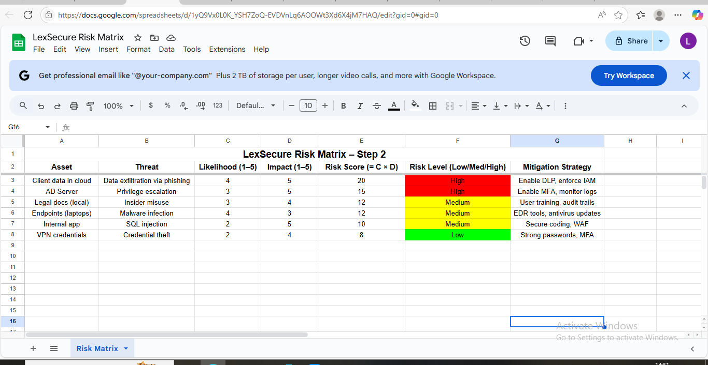

# Step 2: Risk Assessment for LexSecure Compliance Firm

## Assessment Approach

We conducted a qualitative risk assessment using a Risk Matrix approach to evaluate cybersecurity threats to LexSecure’s key assets. Each risk is assessed by multiplying the **Likelihood** (1 to 5) by the **Impact** (1 to 5), generating a **Risk Score**. Based on the score, risks are classified as Low, Medium, or High priority.

The matrix was implemented in Google Sheets with conditional colour coding to highlight severity levels.

## Assets, Threats, and Risk Scores

| Asset               | Threat                          | Likelihood (1–5) | Impact (1–5) | Risk Score (= L × I) | Risk Level        | Mitigation Strategy            |
|---------------------|----------------------------------|------------------|--------------|-----------------------|--------------------|-------------------------------|
| Client data in cloud| Data exfiltration via phishing   | 4                | 5            | 20                    | High               | Enable DLP, enforce IAM       |
| AD Server           | Privilege escalation             | 3                | 5            | 15                    | High               | Enable MFA, monitor logs      |
| Legal docs (local)  | Insider misuse                   | 3                | 4            | 12                    | Medium             | User training, audit trails   |
| Endpoints (laptops) | Malware infection                | 4                | 3            | 12                    | Medium             | EDR tools, antivirus updates  |
| Internal app        | SQL injection                    | 2                | 5            | 10                    | Medium             | Secure coding, WAF            |
| VPN credentials     | Credential theft                 | 2                | 4            | 8                     | Low                | Strong passwords, MFA         |

## Top Risks Identified

- **Data exfiltration via phishing targeting client cloud data** (High risk)  
- **Privilege escalation on Active Directory server** (High risk)  
- **Insider misuse of local legal documents** (Medium risk)  

These risks will be prioritised for mitigation and further testing in subsequent project steps.

## Tools and References

- Google Sheets for Risk Matrix creation and colour coding  
- NIST SP 800-30 guidance on risk assessment and scoring  
- LexSecure SME Profile for context and asset identification  

## Screenshot

The complete LexSecure Risk Matrix is visualised in the screenshot below:  

This shows the full risk matrix table with colour coding for risk levels.

