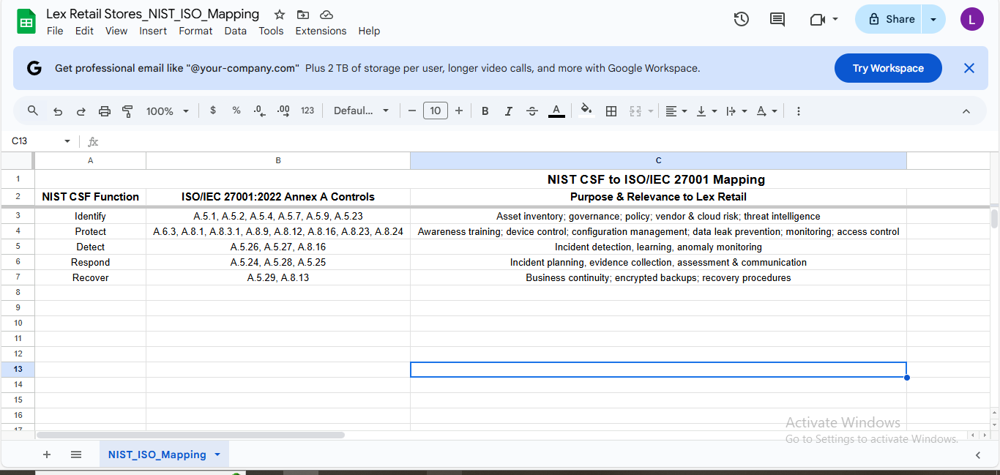

# Step 7: NIST CSF to ISO/IEC 27001 Mapping – Lex Retail Stores

In this step, we mapped the NIST Cybersecurity Framework (CSF) core functions to the relevant ISO/IEC 27001:2022 Annex A controls. This helps ensure that Lex Retail Stores can align its security improvements to globally recognised standards while keeping implementation practical and low-cost for a small startup.

### Why This Mapping Matters

The NIST CSF provides a flexible framework that helps identify and prioritise cybersecurity outcomes. However, for certification or formal compliance, organisations must adopt detailed controls—such as those found in ISO/IEC 27001. This mapping connects Lex Retail’s cybersecurity efforts with actionable controls suited to its size, risk level, and maturity.

### NIST CSF to ISO/IEC 27001 Mapping Table

| NIST CSF Function | ISO/IEC 27001:2022 Annex A Controls     | Key Focus Area |
|-------------------|------------------------------------------|----------------|
| **Identify**      | A.5.1, A.5.2, A.5.4, A.5.7, A.5.9, A.5.23 | Asset inventory, policy, threat intel, vendor/cloud risk |
| **Protect**       | A.6.3, A.8.1, A.8.3.1, A.8.9, A.8.12, A.8.16, A.8.23, A.8.24 | Awareness, device protection, config mgmt, DLP, monitoring, access control |
| **Detect**        | A.5.26, A.5.27, A.8.16                   | Event detection, anomaly monitoring |
| **Respond**       | A.5.24, A.5.28, A.5.25                   | Incident planning, communications, legal evidence |
| **Recover**       | A.5.29, A.8.13                           | Continuity planning, secure recovery |

### Mapping Screenshot

Below is the embedded screenshot of the updated NIST–ISO mapping matrix from our team’s shared documentation:

### Summary

This mapping allows Lex Retail Stores to:

- Align foundational NIST CSF activities with global ISO/IEC controls
- Support future ISO certification if needed
- Use existing open-source or low-cost tools to implement these controls
- Show accountability to stakeholders and regulators

This will directly inform our testing strategy in Step 10 and final presentation in Step 11.

